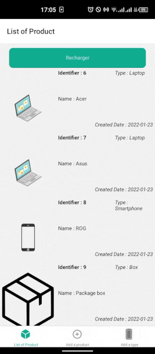

# The Product 
<!--
*** This project is the result of test at ModelSis
*** Author : Salomon DAHOUN
-->

[![Contributors][contributors-shield]][contributors-url]
[![Forks][forks-shield]][forks-url]
[![Stargazers][stars-shield]][stars-url]
[![Issues][issues-shield]][issues-url]
[![MIT License][license-shield]][license-url]
[![LinkedIn][linkedin-shield]][linkedin-url]


<!-- PROJECT LOGO -->
<br />
<p align="center">
  <a href="https://github.com/salomon-dhn/modelsis-react-native-fullstack">
    
  </a>

  <h3 align="center">The Product</h3>

  <p align="center">
    The product is a mobile application developed in React-Native. It allows you to view the list of registered products, to add and modify a product, to add a product type. It uses an online API that has been developed with SpringBoot. All this in a user-friendly interface!
    <br />
    <a href="https://github.com/salomon-dhn/modelsis-react-native-fullstack"><strong>Explore the docs »</strong></a>
    <br />
    <br />
    <a href="https://github.com/salomon-dhn/modelsis-react-native-fullstack">View Demo</a>
    ·
    <a href="https://github.com/salomon-dhn/modelsis-react-native-fullstack/issues">Report Bug</a>
    ·
    <a href="https://github.com/salomon-dhn/modelsis-react-native-fullstack/pulls">Request Feature</a>
  </p>
</p>


<!-- TABLE OF CONTENTS -->
<details open="open">
  <summary><h2 style="display: inline-block">Table of Contents</h2></summary>
  <ol>
    <li>
      <a href="#about-the-project">About The Project</a>
      <ul>
        <li><a href="#built-with">Built With</a></li>
      </ul>
    </li>
    <li>
      <a href="#getting-started">Getting Started</a>
      <ul>
        <li><a href="#prerequisites">Prerequisites</a></li>
        <li><a href="#installation">Installation</a></li>
      </ul>
    </li>
    <li><a href="#usage">Usage</a></li>
    <li><a href="#roadmap">Roadmap</a></li>
    <li><a href="#contributing">Contributing</a></li>
    <li><a href="#license">License</a></li>
    <li><a href="#contact">Contact</a></li>
    <li><a href="#acknowledgements">Acknowledgements</a></li>
  </ol>
</details>


<!-- ABOUT THE PROJECT -->
## About The Project
The product is a mobile application developed in React-Native. It allows you to view the list of registered products, to add and modify a product, to add a product type. It uses an online API that has been developed with SpringBoot. All this in a user-friendly interface!
<br />
<p align="center">
<a align="center" href="https://github.com/salomon-dhn/modelsis-react-native-fullstack">
  
  
</a>
</p>

### Built With

* [React-Native](https://reactnative.dev)
* [Node JS 14.8.3](https://nodejs.org)
* [React Navigation](https://reactnavigation.org)


<!-- GETTING STARTED -->
## Getting Started

To get a local copy up and running follow these simple steps.

### Prerequisites

Follow this link to set up the development environment : [Setting up the development environment](https://reactnative.dev/docs/environment-setup)

### Note
This Application was built with NodeJS 14.8.3 LTS Fermium


### Installation

1. Clone the repo
   ```sh
   git clone https://github.com/salomon-dhn/modelsis-react-native-fullstack.git
   ```
2. Install NPM packages
   ```sh
   npm install
   ```
3. Start Metro, the JavaScript bundler that ships with React Native
    ```sh
   npx react-native start
   ```
4. In a new terminal opened inside the project folder, run : 
    ```sh
   npx react-native run-android
   ```
Congratulations !!!

**_Note:_** For a deployment test on an iOS Phone, please refer to the [ReactNative Documentation](https://reactnative.dev/docs/getting-started)_

<!-- USAGE EXAMPLES -->
## Usage

You can check  API documentation at _[ModelSIS API Database](https://modelsis.herokuapp.com/swagger-ui/)_

_For more information, please refer to the [ReactNative Documentation](https://reactnative.dev/docs/getting-started)_


<!-- ROADMAP -->
## Roadmap

See the [open issues](https://github.com/salomon-dhn/modelsis-react-native-fullstack/issues) for a list of proposed features (and known issues).


<!-- CONTRIBUTING -->
## Contributing

Contributions are what make the open source community such an amazing place to be learn, inspire, and create. Any contributions you make are **greatly appreciated**.

1. Fork the Project
2. Create your Feature Branch (`git checkout -b feature/AmazingFeature`)
3. Commit your Changes (`git commit -m 'Add some AmazingFeature'`)
4. Push to the Branch (`git push origin feature/AmazingFeature`)
5. Open a Pull Request


<!-- LICENSE -->
## License

Distributed under the MIT License. See `LICENSE` for more information.


<!-- CONTACT -->
## Contact

LinkedIN - [Salomon](https://www.linkedin.com/in/1sal)

Project Link: [https://github.com/salomon-dhn/modelsis-react-native-fullstack](https://github.com/salomon-dhn/modelsis-react-native-fullstack)


<!-- ACKNOWLEDGEMENTS -->
## Acknowledgements
* [MoodelSis](http://modelsis.sn)
* [React-Native](https://reactnative.dev)
* [React Navigation](https://reactnavigation.org)
* [Ionicons](https://ionic.io/ionicons)


<!-- MARKDOWN LINKS & IMAGES -->
<!-- https://www.markdownguide.org/basic-syntax/#reference-style-links -->
[contributors-shield]: https://img.shields.io/github/contributors/salomon-dhn/modelsis-react-native-fullstack.svg?style=for-the-badge
[contributors-url]: https://github.com/salomon-dhn/modelsis-react-native-fullstack/graphs/contributors
[forks-shield]: https://img.shields.io/github/forks/salomon-dhn/modelsis-react-native-fullstack.svg?style=for-the-badge
[forks-url]: https://github.com/salomon-dhn/modelsis-react-native-fullstack/network/members
[stars-shield]: https://img.shields.io/github/stars/salomon-dhn/modelsis-react-native-fullstack.svg?style=for-the-badge
[stars-url]: https://github.com/salomon-dhn/modelsis-react-native-fullstack/stargazers
[issues-shield]: https://img.shields.io/github/issues/salomon-dhn/modelsis-react-native-fullstack.svg?style=for-the-badge
[issues-url]: https://github.com/salomon-dhn/modelsis-react-native-fullstack/issues
[license-shield]: https://img.shields.io/github/license/salomon-dhn/modelsis-react-native-fullstack.svg?style=for-the-badge
[license-url]: https://github.com/salomon-dhn/modelsis-react-native-fullstack/tree/master/LICENSE
[linkedin-shield]: https://img.shields.io/badge/-LinkedIn-black.svg?style=for-the-badge&logo=linkedin&colorB=555
[linkedin-url]: https://www.linkedin.com/in/1sal
[product-screenshot]: https://github.com/salomon-dhn/web-page/blob/main/assets/img/app.gif
